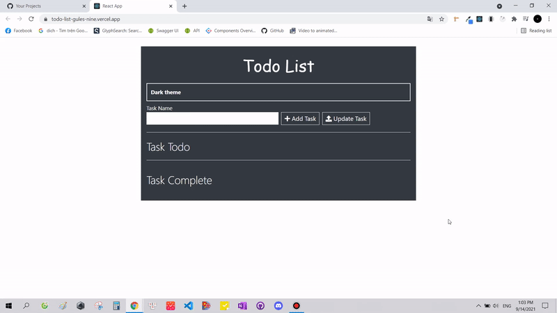

<h1>TodoList</h1>
<h4>Technologies: React class component, Redux, Styled component</h4>
<h4>Source: https://github.com/thachsteven/TodoList</h4>
<h4>Live demo: https://todo-list-gules-nine.vercel.app/</h4>

<h3>
  A  TodoList app
</h3>

<h2>Setting up development environment 🛠</h2>

<ul>
  <li><h4>git clone https://github.com/thachsteven/TodoList.git</h4></li>
  <li><h4>cd TodoList</h4></li>
  <li><h4>npm install (or yarn install)</h4></li>
  <li><h4>npm start (or yarn start)</h4></li>
</ul>

